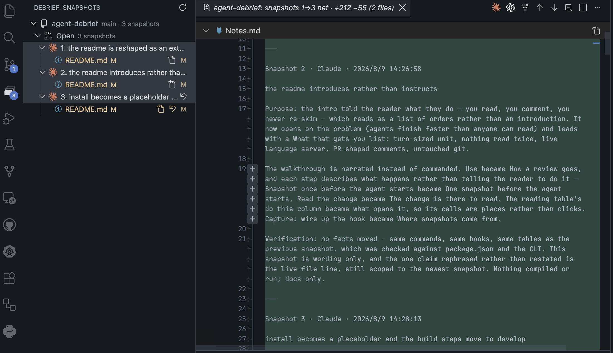

# Agent Debrief

Snapshot-by-snapshot review of agent changes, in the editor where the language server
already runs.

Agents finish work faster than anyone can read it. Debrief is a VS Code extension for the
window that opens between the agent finishing and you deciding — before the commit,
before the PR — and it exists to make that window a comfortable place to sit.

Every turn the agent completes arrives as a **snapshot**, and a snapshot's diff is its own
change: **snapshot N-1 → snapshot N**.

**What that gets you**

- **A unit worth reading.** A whole turn's work, rather than an edit at a time.
- **Nothing read twice.** A file cleared at snapshot 2 stays cleared when snapshot 7
  lands somewhere else.
- **The language server, still attached.** The newest snapshot's right-hand side is the
  real file on disk, so hover, types and go-to-definition come along for the read.
- **Comments that behave like a PR's.** Written a line at a time, collected as one batch,
  answered thread by thread — on code that is not a squashed lump yet.
- **Your git where you left it.** The index, HEAD and the branches are never touched.

The package is `agent-debrief`; everything you type is `debrief` — the command line,
the editor commands and the settings.



*Three turns on the left, none of them committed yet; on the right the net diff of all
three, opening on the note each turn left behind.*

## Requirements

| | |
|---|---|
| VS Code | 1.90 or newer, with the built-in Git extension enabled |
| git | any version with `commit-tree` and worktrees — anything current |
| Node | 20 or newer, for the `debrief` CLI the agent and the hooks call |

The repository being reviewed must be a git repository with at least one commit.

## Install

> **Not on the marketplace yet.** The listing, the one-click install and the
> `ext install` line belong here, and this section is the space held for them.
> Until they exist, [Develop](#develop) is how it gets running.

Every example below types `debrief`, which is `out/cli.js` — the bin the package
declares. Where it is not on your `PATH`, `node <debrief>/out/cli.js` is the same command.

## Where snapshots come from

Snapshots are taken by whoever finishes the work. For Claude Code, one Stop hook in
`.claude/settings.json` captures every turn — the label and the note come from the
turn's own closing message, so a snapshot arrives already described:

```json
"hooks": {
  "Stop": [{ "hooks": [{ "type": "command",
    "command": "/bin/sh -c 'node <debrief>/out/cli.js snapshot --from-stop-hook >/dev/null; exit 0'"
  }]}]
}
```

A second hook beside it is optional, and keeps your **own** edits between turns in a
snapshot of their own rather than inside the agent's next one:

```json
"UserPromptSubmit": [{ "hooks": [{ "type": "command",
  "command": "node <debrief>/out/cli.js snapshot --agent manual --label 'before the turn'" }]}]
```

Snapshotting is idempotent — a turn that changed nothing takes no snapshot — so neither
hook can pollute the numbering.

**No hook available?** Any agent that can run a command can record its own:

```bash
debrief snapshot --label "what the snapshot did" --agent codex
```

And any agent at all can be reviewed by taking a snapshot yourself before and after it
works.

## How a review goes

1. **One snapshot before the agent starts.** The first snapshot diffs against `HEAD`, so
   anything already sitting in the tree would otherwise turn up inside snapshot 1. The
   camera on the repo's row takes it, and so does **Debrief: Take Snapshot** in the palette.
2. **The agent works.** Nothing on this side blocks it. When it stops, the hook captures
   the snapshot and a row appears in the Snapshots view; the activity-bar icon carries a
   badge counting what is still waiting.
3. **The change is there to read.** Clicking a file opens its snapshot-over-snapshot
   diff. The first row of every review is `Notes.md` — the agent's label and the few
   lines under it, worth reading before the diff. A `src/review.ts:270` in a note is a link.
4. **Comments are open as they are written.** No send step, and nothing to remember at
   the end of a read.
5. **The agent picks the batch up.** "I have reviewed" is enough — it runs
   `debrief review open` and gets the shape of the review in one reply, which is the path
   that costs nothing. For agents that never ask, **Copy Review for the Agent** sits on
   the repo's row, and **Send Review to the Agent's Terminal** is in its right-click menu.
6. **Answers land under your comments.** The agent fixes what it can and replies with
   `debrief review reply`. The **✓** that closes a thread stays yours — an agent never
   closes its own work.
7. **Landing is a prefix.** `debrief snapshot commit <n> -m "<subject>"` takes snapshots
   1..n as one commit. The working tree never moves, and snapshots n+1 stay uncommitted
   exactly as they were.

The live file on the right-hand side is the newest snapshot's privilege alone; older ones
diff two revisions and are read-only by nature.

### Reading a change

| you want | what opens it |
|---|---|
| one file, one snapshot | the file row |
| everything one snapshot did | the snapshot row |
| several snapshots as one change | **Open Net Diff of Selected Snapshots** on the repo row, with them selected |
| everything not yet committed | the **Open** area row |
| one file's evolution across snapshots | **Open Step History** on the file row |
| the whole lane | the repo row |

A row marked `⇣` is not the agent's change — it arrived when HEAD moved under that
snapshot. A row struck through is **frozen**: nothing of it is left on disk.

### Rejecting work

**Revert This Snapshot's Change** on a file row puts that one file back to how it was
before the snapshot — working tree only. The same action on a snapshot row undoes the
whole thing, takes its comments with it, and rewrites the later snapshots so they stop
carrying the reverted content. **Drop This Snapshot** removes one from the middle when
nothing of it is left.

### Several repositories

The unit of review is the repository, not the workspace folder. Folders resolve to their
git roots and dedupe, so a workspace holding four clones shows four repos, each with its
own numbering, its own `.git/debrief/` and its own review. Every action lives on its
repository's row. A **Repositories** view appears above Snapshots when there is more than
one, with a checkbox per repo — unchecking one hides its review without touching it.

## Commands

All of them are in the palette under **Debrief**, and act on the row you have selected.

| command | where |
|---|---|
| Take Snapshot | camera on the repo row |
| Open Net Diff of Selected Snapshots | repo row |
| Copy Review for the Agent | clipboard on the repo row |
| Send Review to the Agent's Terminal | repo row, right-click |
| Delete This Branch's Snapshots | repo row, right-click |
| Let Go of Abandoned Lanes | bin on a repo whose branch is gone |
| Open Step History | file row, right-click |
| Open This File's Diff | clicking the file row · Open File is the icon beside it |
| Revert This Snapshot's Change | file or snapshot row |
| Drop This Snapshot | snapshot row, once frozen |
| Read the Whole Note | link in the snapshot row's hover |
| Show All Repositories · Refresh | view title |

Adding, replying to and resolving a comment live on the comment widget itself.

## Settings

| setting | default | |
|---|---|---|
| `debrief.author` | `""` | Name recorded on review comments. Empty uses the repository's `git user.name`, which is what every other record of this work carries. |

## The CLI

`debrief` is the contract every surface that is not the extension talks through — hooks,
skills, agents, other editors. Machine-facing commands take `--json` and print one object
carrying `schemaVersion`.

| | |
|---|---|
| `debrief status` | repo, lane, snapshots and review state; captures nothing |
| `debrief snapshot` | capture one (`--label`, `-m`, `--agent`, `--from-stop-hook`) |
| `debrief snapshot describe <n>` | give a snapshot the message it should have had |
| `debrief snapshot commit <n> -m` | commit snapshots 1..n as one commit |
| `debrief diff <n>` · `debrief show <rev> <path>` | what a snapshot changed, and file content at it |
| `debrief review open` | every comment still waiting on the agent |
| `debrief review reply <id> -m` | say what you did about one; it stays open |
| `debrief review resolve <id>…` | close what the reviewer says is done |
| `debrief review submit` · `review batch` | write the open threads out as one batch file, and read the last one |
| `debrief gc [--dry-run]` | let go of lanes whose branch is gone |

Two skills ship with the repo and are the agent's half of the loop:
[`prepare-change-review`](skills/prepare-change-review/SKILL.md) for the end of a turn,
[`recover-change-context`](skills/recover-change-context/SKILL.md) for picking up a
branch it does not remember.

## Your git state is not touched

Snapshots are built through a private index file (`GIT_INDEX_FILE`), so `git add -A`
never reads or writes the index you are curating. The commit object is written with
`commit-tree` and referenced under `refs/debrief/snapshots/<lane>/<n>` — outside
`refs/heads`, so `git branch` never lists it.

| | before snapshot | after |
|---|---|---|
| staged files | `M  b.py` | `M  b.py` |
| HEAD | `base` | `base` |
| branches | `main` | `main` |

Review state lives in `.git/debrief/`, so it never appears in `git status` and needs no
`.gitignore` entry.

## Why not per-edit approval

Approving every edit degrades to "approve all" the moment the agent is good enough to be
worth using — the same failure as auto mode, with more clicking. Reviewing a whole turn's
worth of work keeps a real decision point at a granularity worth reading.

## Develop

Building it is also how it is installed, until there is a listing to install from:

```bash
pnpm install
pnpm run compile
pnpm run dev    # a second VS Code, with the extension loaded
pnpm test       # headless: git plumbing + store, no editor needed
```

`F5` from this repo opens the same Extension Development Host through the debugger, on
[.vscode/debrief.code-workspace](.vscode/debrief.code-workspace) — this repo wrapped as a
workspace, so it lands in a window of its own.

`src/core/` is the headless half — git plumbing, lanes, the store, review state — and
imports nothing from `vscode`; that is what lets the CLI and the tests run without an
editor. `src/ui/` is everything that draws. Both entry points stay at the `src/` root, so
`main` and `bin` remain `out/extension.js` and `out/cli.js`.

## Docs and status

[docs/WORKFLOWS.md](docs/WORKFLOWS.md) is the full guide — every situation this is for,
what you click and what the agent runs. [docs/PRD.md](docs/PRD.md) is what and why,
[docs/PLAN.md](docs/PLAN.md) the order it landed in, [docs/GIT.md](docs/GIT.md) the
plumbing.

M1: lane-scoped core + CLI + extension client, TypeScript end to end. Comments land as a
JSON batch in the reviewed repo's own `.git`; the intended home for sharing is an Octomate
review batch (M5). Not built yet: asking the agent from a comment thread, reviewing a
GitHub PR through the same ritual, and plans as reviewable snapshots.
